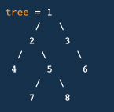

## Height Balanced Binary Tree

You're given the root node of a Binary Tree. Write a function that reeturns true if the Binary Tree
is height balanced and false if it itsn't.
A Binary Tree is height balanced if for each node in the tree, the difference between the height of its
left subtree and the height of its right subtree is at most 1

E.g, the sample tree should return true

